Falconia is the TUI installer for BerserkArch. It runs entirely in your terminal and collects every configuration choice upfront before touching your disk. Once you confirm, it streams live output while performing the full installation.

## Requirements

- A BerserkArch live ISO booted from USB
- A terminal at least **80 × 24** characters (maximise if in doubt)
- Internet access (ethernet recommended; Wi-Fi supported)
- The disk you want to install to (all data on it will be erased)

## Launching the installer

From the live ISO shell run:

```sh
sudo falconia
```

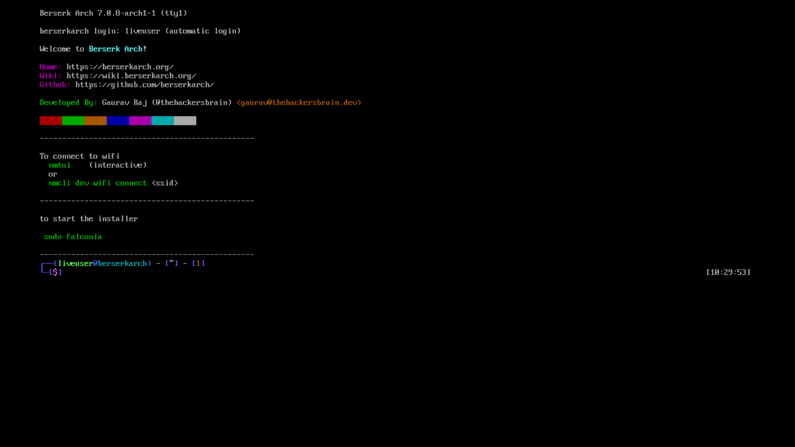

---

## Navigation

| Key                              | Action                       |
| -------------------------------- | ---------------------------- |
| `↑` / `↓` or `Tab` / `Shift+Tab` | Move between fields          |
| `←` / `→`                        | Cycle through inline options |
| `hjkl`                           | Vim style navigation         |
| `Tab` / `Shift+Tab`              | Jump between sections        |
| `Space`                          | Toggle                       |
| `Enter`                          | Confirm / advance            |
| `Esc`                            | Go back one step             |
| `Ctrl+A`                         | Toggle **advanced mode**     |
| `Q`                              | Quit (asks for confirmation) |

The sidebar (visible at ≥ 150 columns) shows a live summary of everything you have chosen so far.

---

## Step-by-step

### Welcome

The welcome screen shows the detected firmware type (UEFI or Legacy BIOS). This affects which bootloaders are available later. Press `Enter` to begin.

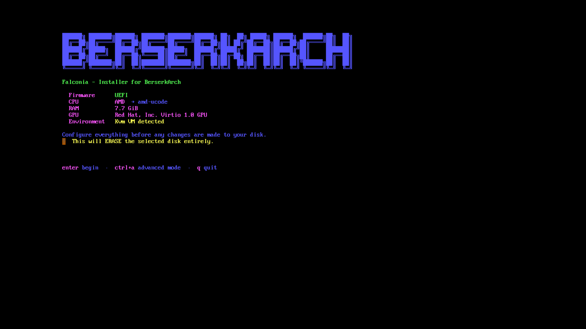

---

### 01 — Disk

Choose the target disk and how it should be set up.

| Field              | Options                    | Notes                                            |
| ------------------ | -------------------------- | ------------------------------------------------ |
| **Disk**           | all detected block devices | `←` / `→` to cycle                               |
| **Scheme**         | `guided` / `manual`        | guided auto-partitions; manual launches `cfdisk` |
| **Filesystem**     | `ext4` / `btrfs`           | applied to the root partition                    |
| **Encrypt**        | `yes` / `no`               | full-disk LUKS encryption                        |
| **Pass / Confirm** | (text input)               | only shown when encrypt is `yes`                 |

:::caution
The selected disk will be **completely erased**. Double-check the device path and size before continuing.
:::

**Advanced mode** (`Ctrl+A`) reveals an extra field:

| Field        | Default | Notes                                                |
| ------------ | ------- | ---------------------------------------------------- |
| **Swap MiB** | `4096`  | size of the swap partition in MiB; `0` disables swap |

**Guided vs manual**

- _Guided_ creates the partition layout automatically: an EFI/boot partition and a root partition (plus swap if configured). You will not see the partition step.
- _Manual_ launches `cfdisk` for full control. After you exit `cfdisk`, you will be taken to a partition-mapping step where you assign mount points to your partitions.

**Encryption**

When enabled, the root partition is encrypted with LUKS1 (`cryptsetup --type luks1`). LUKS1 is required because GRUB cannot unlock LUKS2. Your passphrase is never written to disk or logged.

---

:::tip

**Partition mapping** _(manual scheme only)_

If you chose the manual scheme you will land here after `cfdisk` exits. Assign each partition (e.g. `/dev/sda1`) to a mount point (e.g. `/boot`, `/`). At minimum you need `/`.
:::

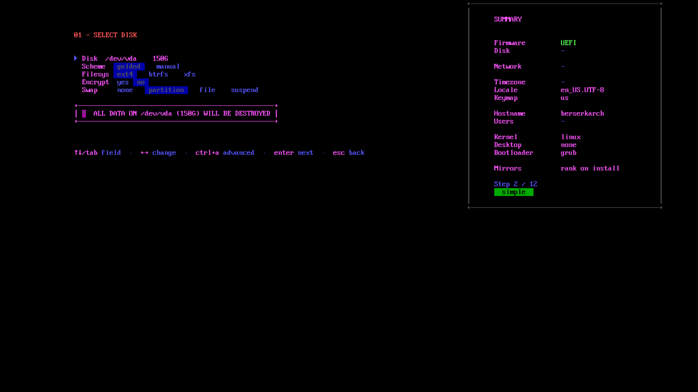

---

### 02 — Network

| Mode       | When to use                                |
| ---------- | ------------------------------------------ |
| `ethernet` | Wired connection — no further input needed |
| `wifi`     | Enter your SSID and passphrase             |
| `skip`     | Dangerous — `pacstrap` requires internet   |

Wi-Fi credentials are used only to connect during installation. They are not persisted into the installed system's network configuration.

---

### 03 — Locale

Set your timezone, locale, and keyboard map. Falconia ships with a searchable list — start typing to filter. The defaults are:

- Timezone: `Asia/Kolkata`
- Locale: `en_US.UTF-8`
- Keymap: `us`

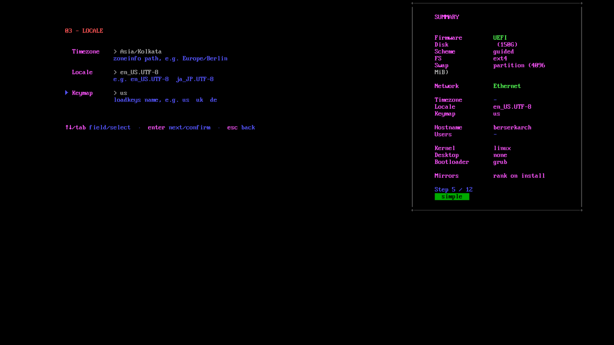

---

### 04 — Hostname

The machine name on your network. Lowercase letters, numbers, and hyphens only; no leading or trailing hyphens. Maximum 63 characters. Defaults to `berserkarch`.

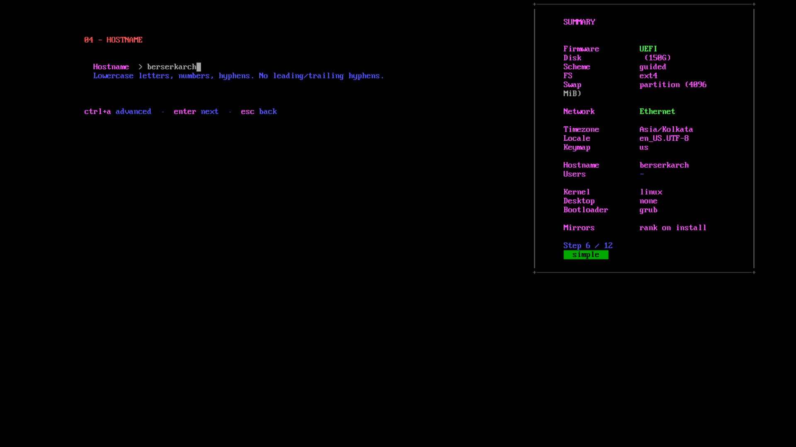

---

### 05 — Users

This step has two sub-screens.

**Root password**
Set and confirm the root account password. You must set a non-empty root password before you can proceed to user creation.
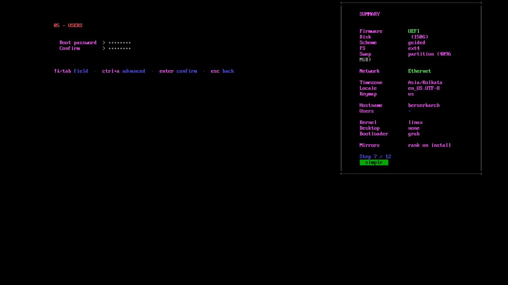

**User account**

| Field              | Notes                                                      |
| ------------------ | ---------------------------------------------------------- |
| Username           | Lowercase alphanumeric + hyphens                           |
| Password / Confirm | Must match                                                 |
| Shell              | `bash` / `zsh` / `fish` — `←` / `→` to cycle               |
| sudo (wheel group) | `Space` to toggle — adds user to `wheel` for `sudo` access |

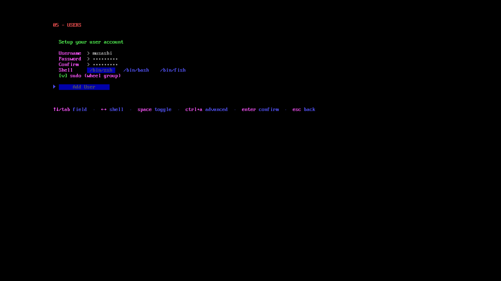

---

### 06 — Kernel

| Option           | Description                                         |
| ---------------- | --------------------------------------------------- |
| `linux`          | Latest stable kernel — recommended for most users   |
| `linux-lts`      | Long-term support — older but very stable           |
| `linux-zen`      | Desktop/gaming optimisations, better latency        |
| `linux-hardened` | Extra security patches — more restrictive behaviour |

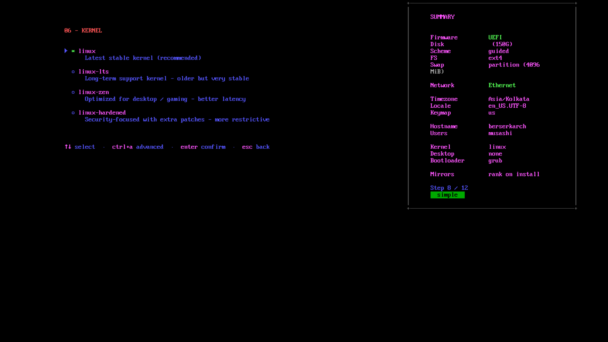

---

### 07 — Desktop environment

| Option         | Display manager | Approx. size |
| -------------- | --------------- | ------------ |
| None (minimal) | —               | 0 MB         |
| GNOME          | GDM             | ~800 MB      |
| KDE Plasma     | SDDM            | ~700 MB      |
| XFCE           | SDDM            | ~250 MB      |
| Hyprland       | SDDM            | ~180 MB      |
| i3wm           | SDDM            | ~120 MB      |
| OpenBox        | SDDM            | ~120 MB      |

Choosing _None_ installs a TTY-only system. You can add a desktop later from the installed system.

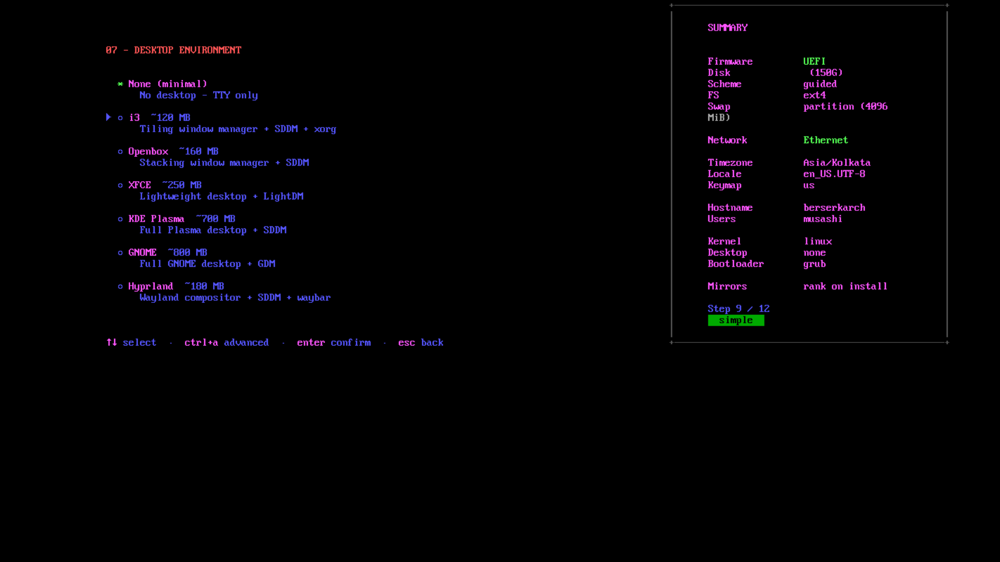

---

### 08 — Extra packages

A categorised package picker. Navigate categories with the left panel and packages with the right panel.

- `Space` — toggle a package
- `Enter` — confirm and advance

Categories include: Browsers & Internet, Development Tools, Multimedia, System Utilities, Gaming, and more. Packages marked `(AUR)` are installed via an AUR helper.

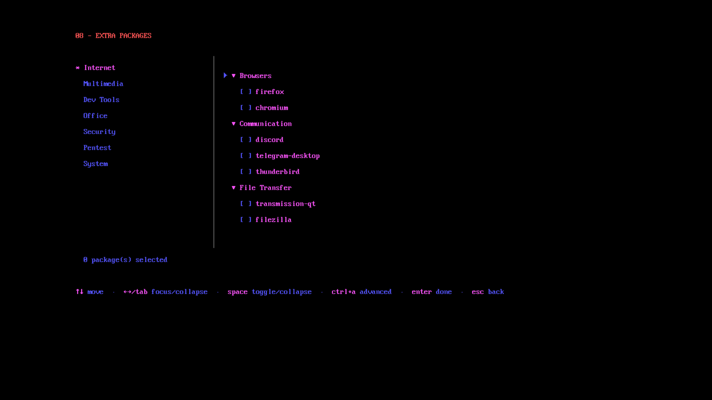

**Advanced mode** shows additional lower-level packages.

---

### 09 — Bootloader

| Option         | Firmware    | Notes                              |
| -------------- | ----------- | ---------------------------------- |
| `grub`         | UEFI + BIOS | Most compatible; works everywhere  |
| `systemd-boot` | UEFI only   | Lightweight, minimal configuration |

`systemd-boot` is only offered on UEFI systems. On legacy BIOS, GRUB is the only option.

When LUKS encryption is enabled, GRUB embeds the crypto modules and a keyfile in the initramfs so you are only prompted for your passphrase once at boot. `systemd-boot` does not use a keyfile (the ESP is unencrypted).

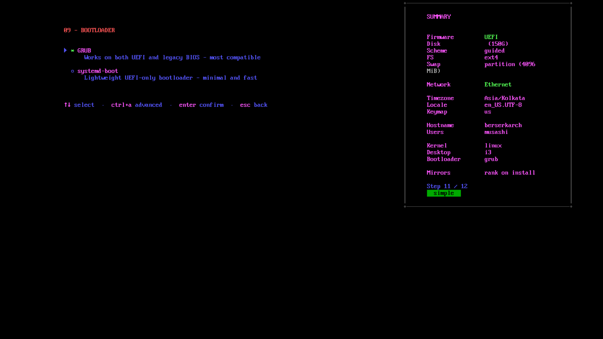

---

### Confirm

A summary screen shows every choice you have made. Review carefully — this is the last step before any changes are made to your disk.

Press `Enter` to start the installation, or `Esc` to go back and change something.

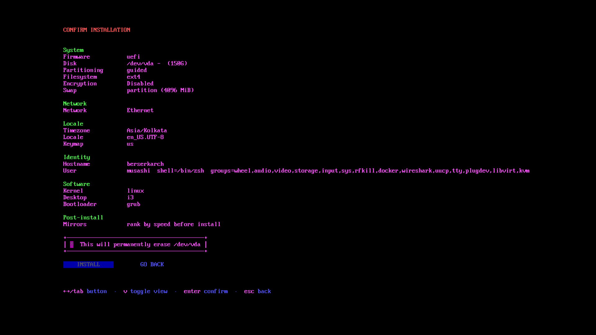

---

## Installation

Once confirmed, Falconia runs the full pipeline. The screen splits into two areas:

- **Left** — a scrolling step list showing completed, in-progress, and pending steps
- **Right** — a live log viewport showing the output of the current operation

The pipeline includes: clock sync, mirror ranking, disk partitioning, filesystem creation, base system install (`pacstrap`), locale and timezone configuration, kernel and initramfs generation (dracut), bootloader install, user creation, hardware driver installation, service configuration, and cleanup.

Most failures are fatal and will show an error screen with the exact command that failed. A small number of steps (clock sync, mirror ranking, Windows detection) are marked _soft_ — a failure shows a warning but the installation continues.

---

## After installation

Once the pipeline completes, reboot and remove the USB:

```sh
reboot
```

Your configured display manager (or a TTY login if you chose _None_) will greet you on first boot.
