This guide provides step-by-step instructions for installing Berserk Arch Linux as a guest operating system in Virtual Machines, optimized for penetration testing and security research.

## Installation

After booting into the live iso, you'll see the **Berserk Welcome** screen.

From here we can take either of 2 ways:
1. Easy Installation (Offline)
2. Advanced Install (Online) -- (_Coming Soon_)

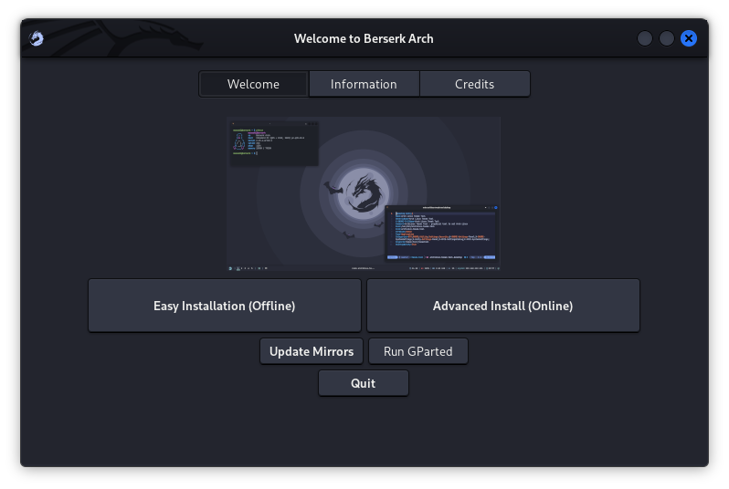

### Starting the _Easy Installation_ (offline)

- Click On `Easy Installation (Offline)` button to launch the installer.

#### Installation
1. Choose the preferred language and click next

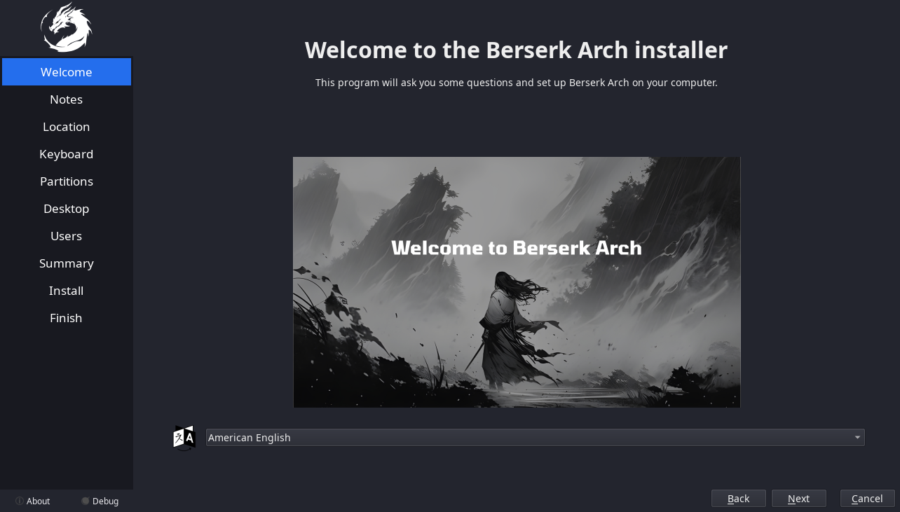

 

2. This is the latest release -- read and click next

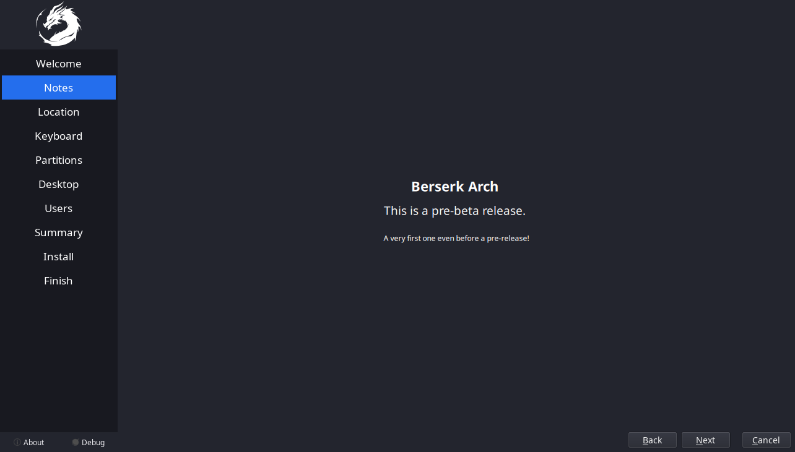

 

3. Choose your region and timezone, either through clicking on the map or through the dropdown menu
    
- proceed with clicking next

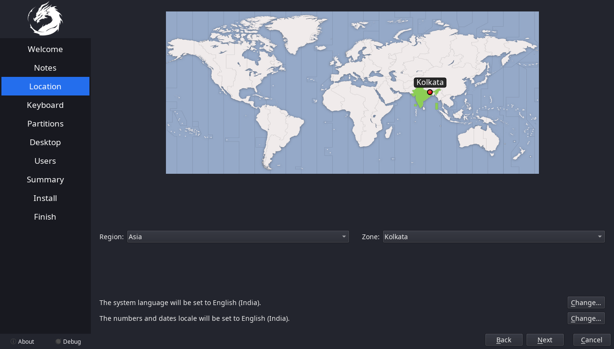

 

4. Select the correct keyboard layout and click next

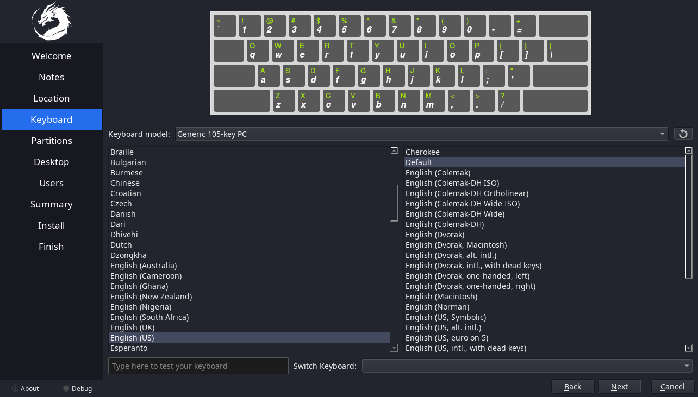

 

5. Now at partitioning part, we have several options

    1. **Erase disk**

        - Now Select The swap type or no swap from the dropdown menu
        - Select the filesystem from the next dropdown.
    
    2. **Manual Partitioning**

        - _Coming Soon..._
        - If you've chosen this, you know what you're doing 😌
    
    3. **Now Choose if you want to `encrypt system`**

        - Click on the checkbox
        - Enter the password
    
    Now click next

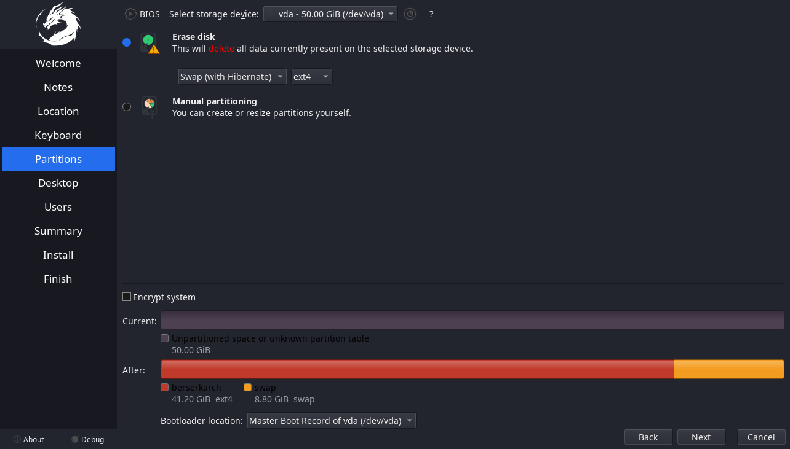

 

6. Choose the desired DE or WM

    - Available Options are:

        1. XFCE
        2. GNOME
        3. I3 WM
        4. Hyprland

    Now click next

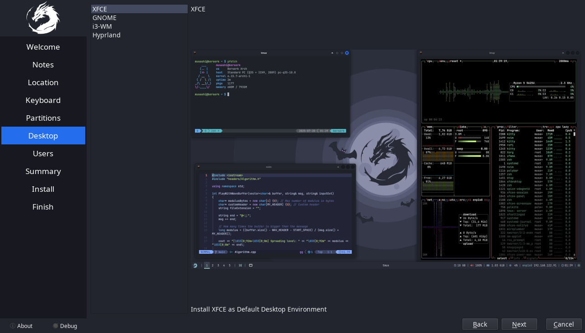

 

7. Now create the user
    - Fill in the name
    - Username
    - hostname of the system
    - type and retype the password

    Then again click Next

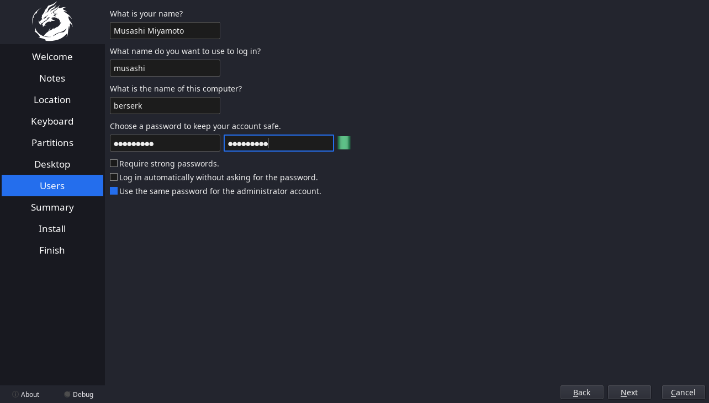

 

8. This is the summary of your chosen options
    
    - If satisfied, click Install
    - else, click back and change what you like.

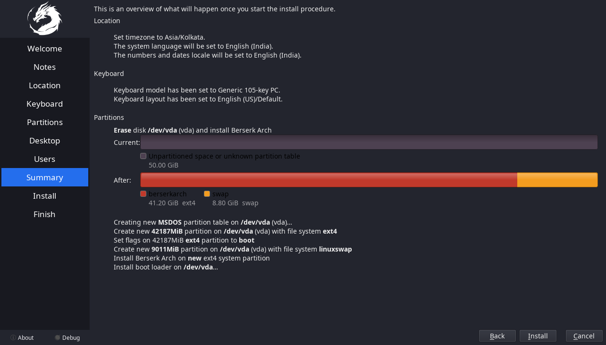

 

9. The installation is going to take a while, just wait for it

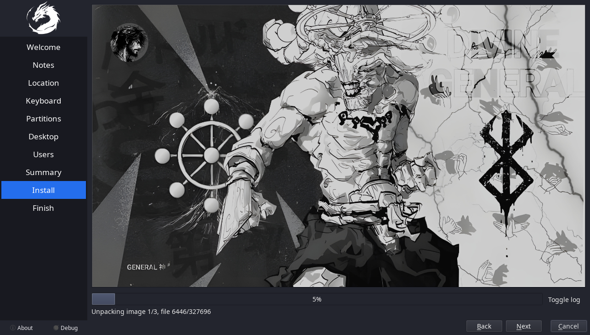

 

10. Click on Reboot to reboot the system.

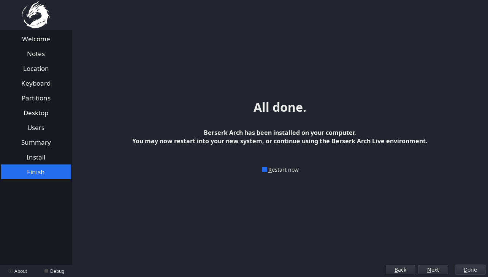

## Finish

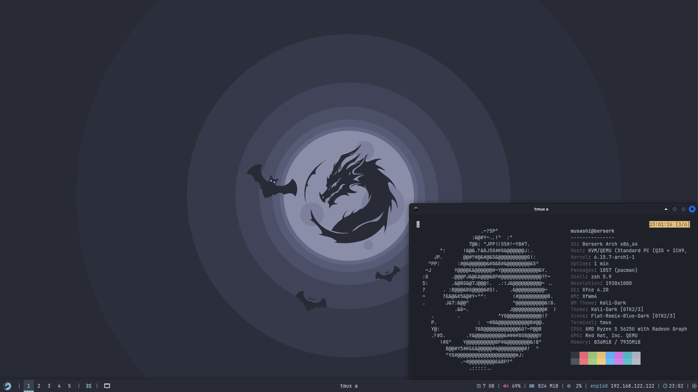

and Now we have installed Berserk Arch.
