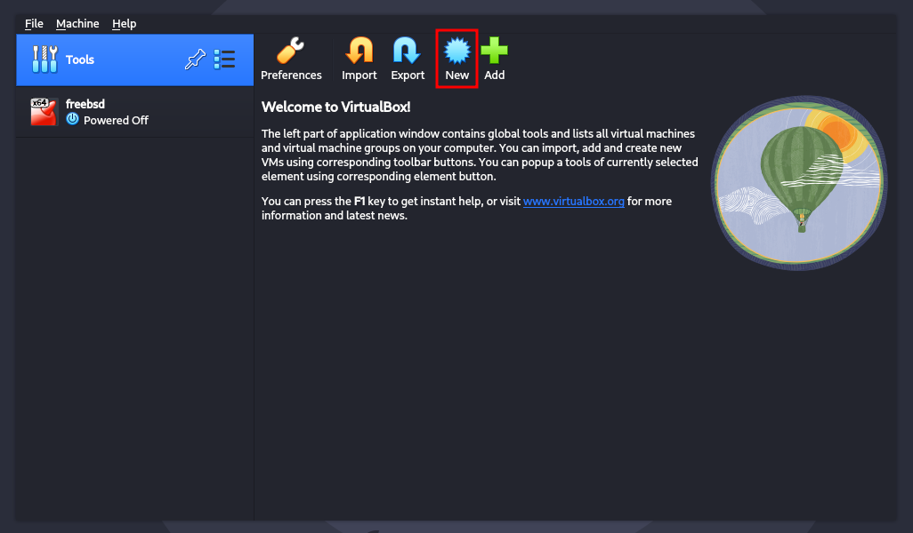
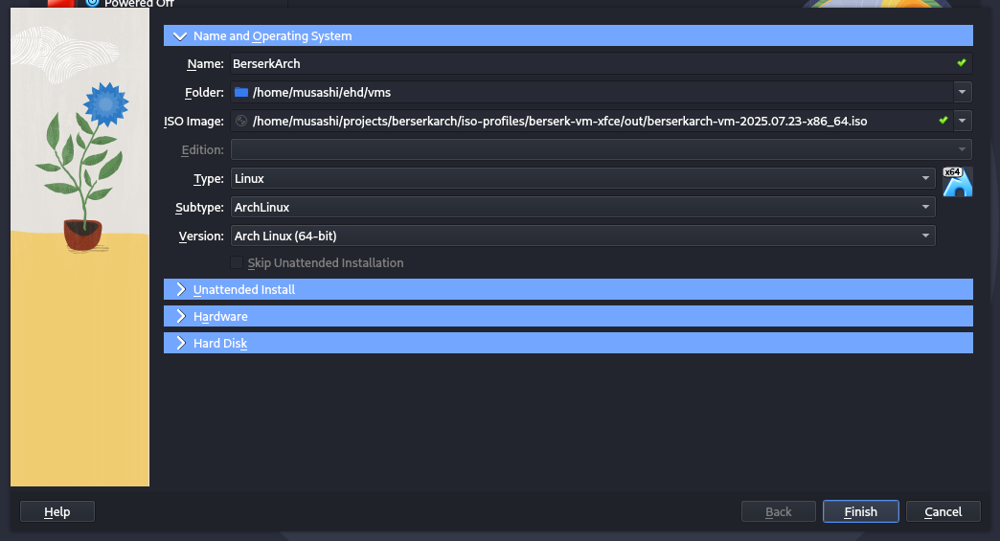
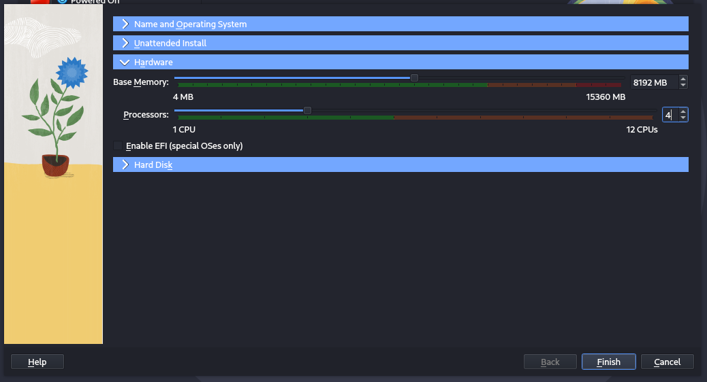
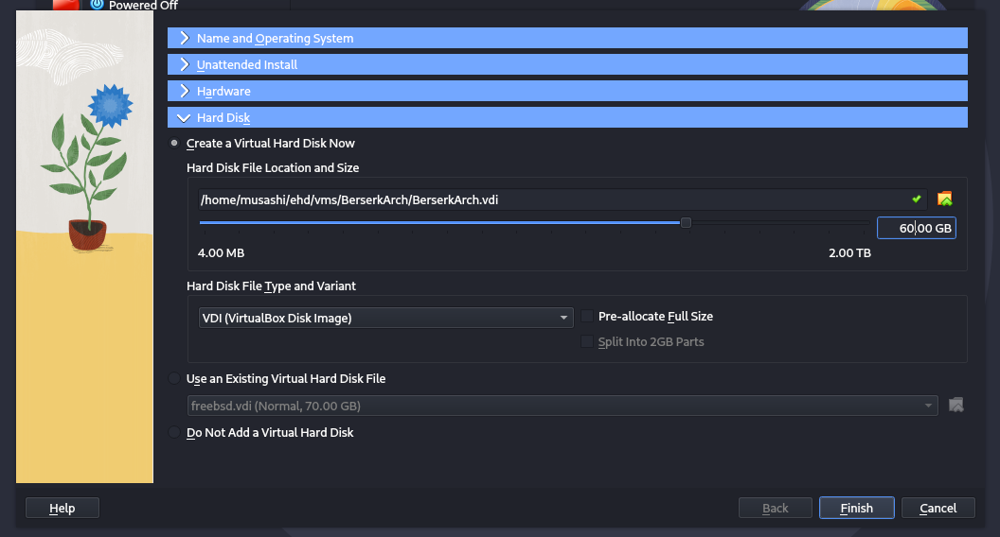
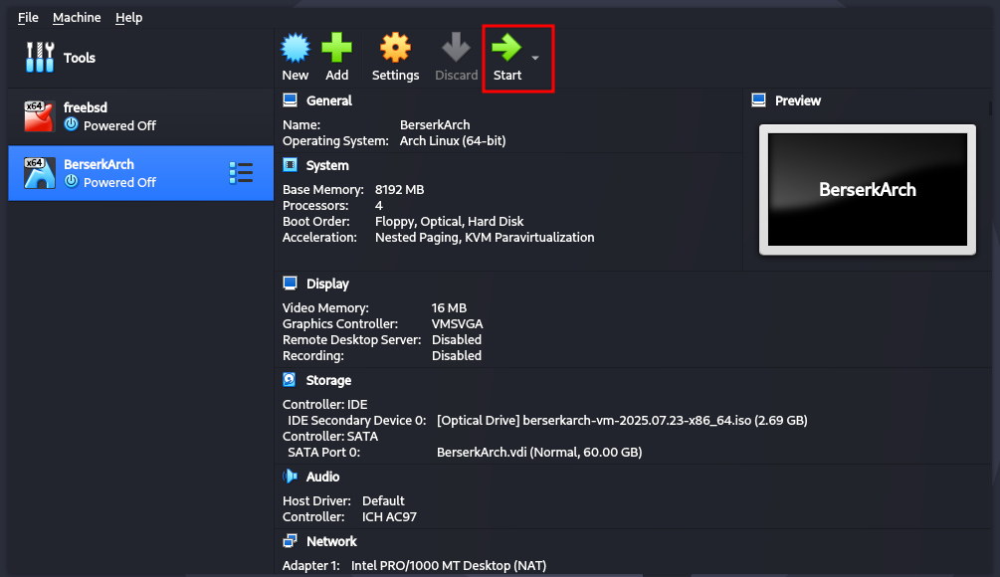
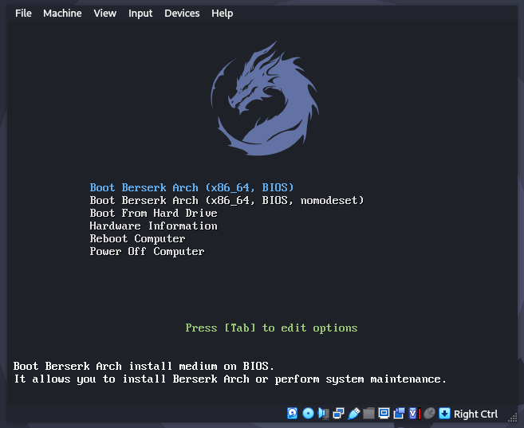
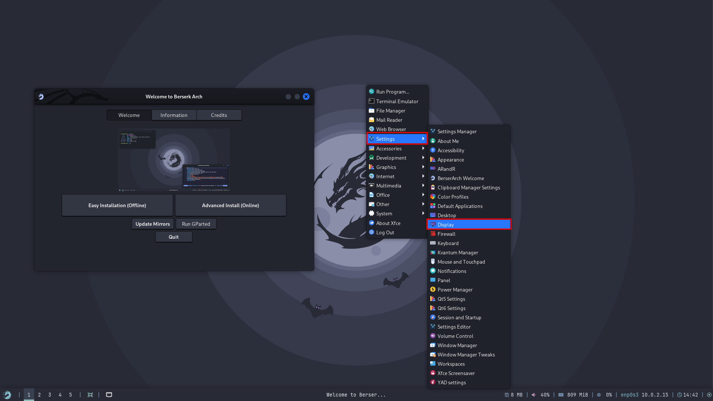
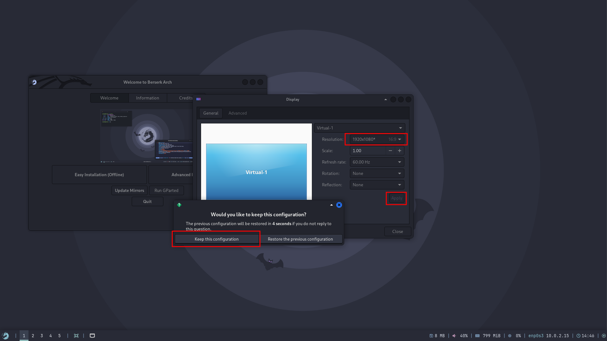
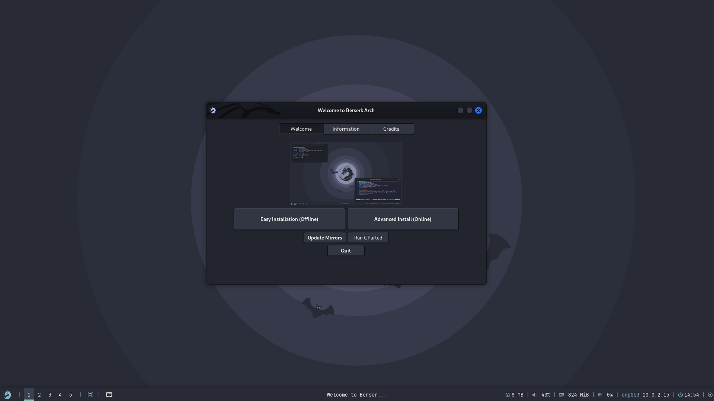

This guide provides step-by-step instructions for installing Berserk Arch Linux as a guest operating system in Oracle VirtualBox using the Calamares graphical installer, optimized for penetration testing and security research.

---

## Prerequisites

### Host System Requirements
- **VirtualBox Version**: 7.0+ (latest recommended)
- **Host RAM**: 8GB minimum (16GB+ recommended)
- **Available Storage**: 60GB+ free space
- **CPU**: Intel VT-x or AMD-V virtualization support
- **Host OS**: Windows 10/11, macOS 10.15+, or Linux kernel 4.0+

### Download Requirements
- Berserk Arch ISO file (with Calamares installer)
- VirtualBox Extension Pack (for enhanced features)

---

## Virtual Machine Creation

### Step 1: Create New VM

1. **Launch VirtualBox Manager**
   - Click "New" button



### Step 2: Virtual Machine Configuration

2. **Name and Operating Sytem**
   ```
   Name: BerserkArch
   Type: Linux
   Subtype: ArchLinux
   Version: Arch Linux (64-bit)
   ```



3. **Unattended Install**

    Leave this part as is, and click `Hardware`

4. **Hardware**
    ```bash
    Base Memory: 8192 MB # for 8 GB use 4096 for 4 GB
    Processors: 4 # give as much as you can
    ```

    now click on `Hard Disk` next



4. **Hard Disk**

    Select `create a virtual hard disk now`
    ```bash
    Size: 60 GB # atleast give it this much
    ```

    now click on **Finish**



### Step 3: Start the VM


<br/>
<br/>


## Installation Process

### Step 1: Boot from ISO

1. **Boot Menu Selection**
   - Select "Boot Berserk Arch (x86_64)" and hit enter.
   - Wait for live environment to load



### Step 2: Live Environment

The system will boot into *XFCE DE*, for the password use `liveuser:liveuser`

*[IMAGE PLACEHOLDER: Berserk Arch desktop with Calamares installer icon]*

#### Pre-Installation Checks
1. **Display Resolution**
    For setting up the correct display resolution,
    - Right click on the desktop
    - choose Settings > Display



2. **Set the resolution**
    - Now choose the correct resolution
    - Click on Apply
    - Then click `keep the configuration`




### Installation

Now everything is out-of-way, we can move straight to installation.


    
Here's the [installation guide](/installation/installation/), move on and install the system.