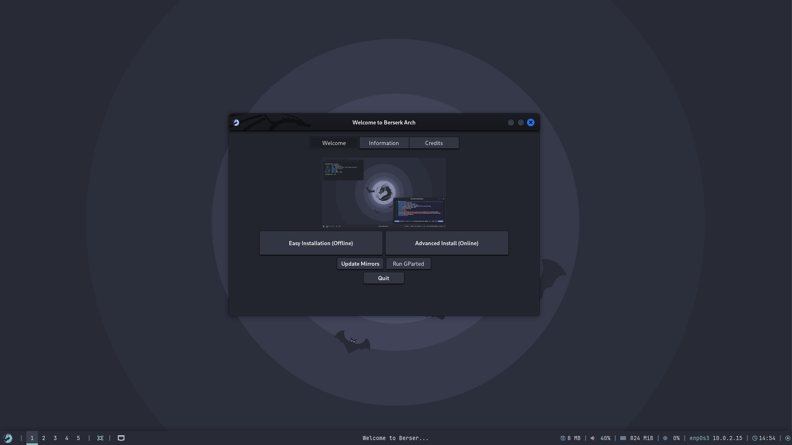

This guide provides step-by-step instructions for installing Berserk Arch Linux as a guest operating system in VMware Player using the Calamares graphical installer, optimized for penetration testing and security research.

You can use whatever you like or have access to either:

    - VMware Player
    - Vmware Workstation

the process of creating the VM is more or less same.

---

## Prerequisites

### Host System Requirements
- **VirtualBox Version**: 7.0+ (latest recommended)
- **Host RAM**: 8GB minimum (16GB+ recommended)
- **Available Storage**: 60GB+ free space
- **CPU**: Intel VT-x or AMD-V virtualization support
- **Host OS**: Windows 10/11, macOS 10.15+, or Linux kernel 4.0+

### Download Requirements
- Berserk Arch ISO file (with Calamares installer)
- VirtualBox Extension Pack (for enhanced features)

---

## Virtual Machine Creation

### Step 1: Create New VM

1. **Launch VMware Player**
   - Click "Create a New Virtual Machine" button
   - click next


### Step 2: Virtual Machine Configuration

2. **Choose the downloaded ISO**
    - Click on 'Use ISO Image' and select the download ISO
    - then click next


3. **Machine Type**
    - Choose 'Linux' for 'Guest Operating System'
    - For version:
        - If Arch Linux is listed choose that
        - If not choose 'Other Linux 6.x kernel 64-bit'
    - then click next


4. **Name the Virtual Machine**
    ```bash
    Name: berserkarch # use whatever you like
    Location: <this section would be pre-filled>
    ```

    now click on next


4. **Hard Disk**

    ```bash
    Size: 60 GB # atleast give it this much
    ```
    - Select `Store virtual disk as a single file`
    - now click on **Next**


5. **Customize VM Options**

    - Now click on 'Customize Hardware'


6. **Specify the RAM**

    ```bash
    Memory: 4096 MB # minimum -- at-least try 8192 MB
    ```
    - now click on **Close**


7. **Create the VM**
    - now click on **Finish** to create VM.


<br/>
<br/>

---

### Step 3: Start the VM

Click on close and the VM will be started, manually start the VM.


<br/>
<br/>


## Installation Process

### Step 1: Boot from ISO

1. **Boot Menu Selection**
   - Select "Boot Berserk Arch (x86_64)" and hit enter.
   - Wait for live environment to load


### Step 2: Live Environment

The system will boot into *XFCE DE*, for the password use `liveuser:liveuser`

#### Pre-Installation Checks
1. **Display Resolution**
    For setting up the correct display resolution,
    - Right click on the desktop
    - choose Settings > Display


2. **Set the resolution**
    - Now choose the correct resolution
    - Click on Apply
    - Then click `keep the configuration`


### Installation

Now everything is out-of-way, we can move straight to installation.


    
Here's the [installation guide](/installation/installation/), move on and install the system.